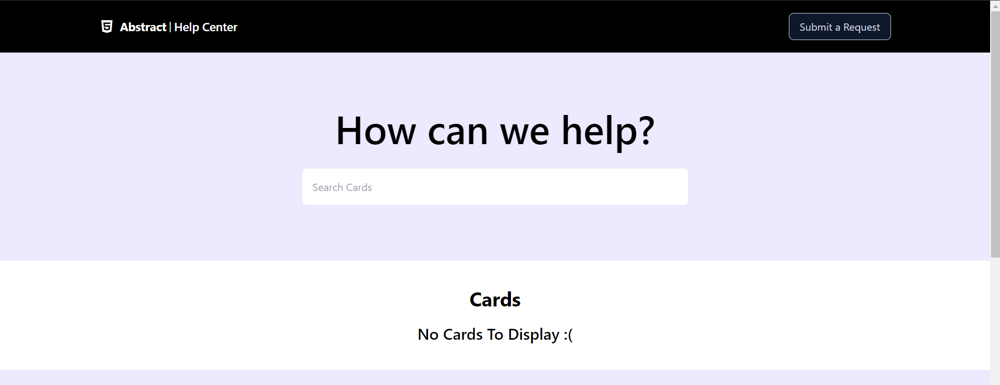
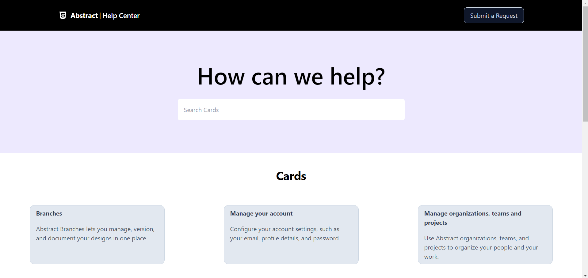
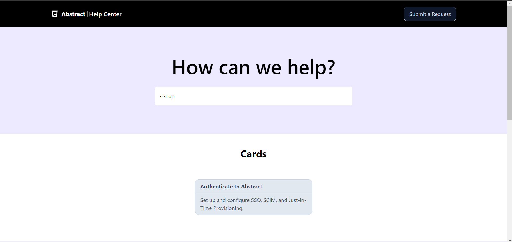
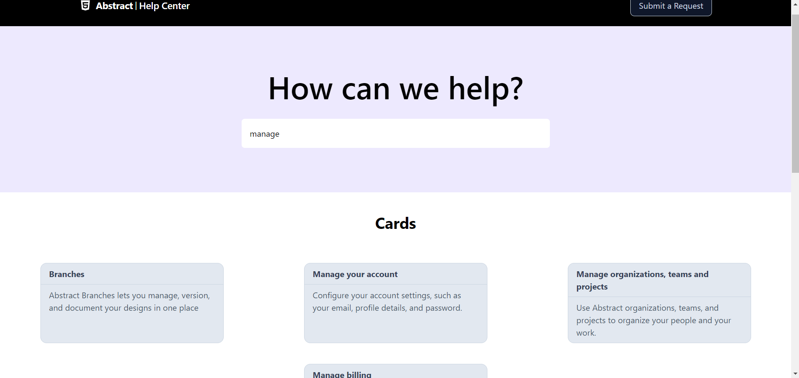
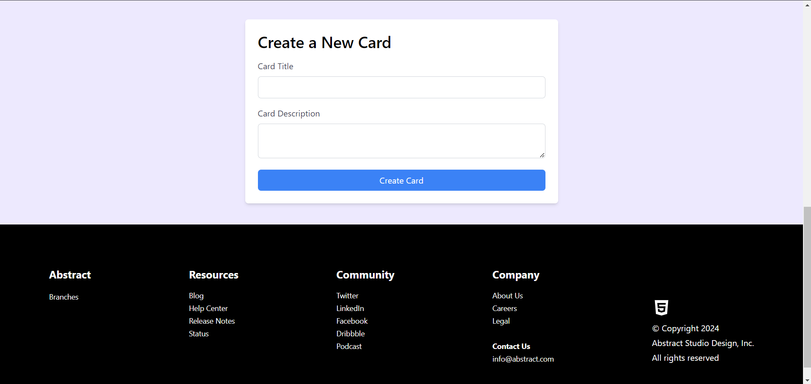
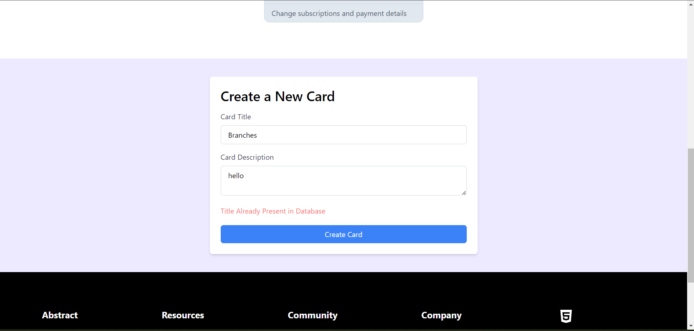

## React Assignment

1. How can you implement shared functionality across a component tree?
   Ans. We can implement shared functionality across a component tree by using context. We wrap our component tree with the context we wish to use and we can then access it using the useContext hook. This helps to achieve centralized state management and helps to avoid prop drilling.

2. Why is the `useState` hook appropriate for handling state in a complex component?
   Ans. The `useState` hook allows developers to encapsulate and isolate state logic within components. This helps to write more cleaner and maintainable code.

3. Images of the user interface resembling the provided page. Search functionality also implemented.

